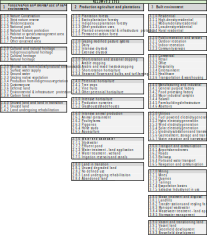

import { Aside, Tabs, TabItem, LinkButton } from '@astrojs/starlight/components';

Classes in **NZLUM** is hierarchical by design, this allows for both the aggregation of broad land-use categories and the disaggregation of specific subclasses for analysis and reporting.

<Aside icon="star">
Each primary class represents a distinct type of human interaction with the land.  
Use attributes like <code>commodity</code>, <code>management_practice</code>, and <code>tenure</code> to add context and detail.
</Aside>

---

---

## Hierarchical Structure

Classes are arranged hierarchically:

- **Primary classes (1–3)** - broad categories of land use  
- **Secondary and tertiary subclasses** - progressively more specific (e.g. 2.2.0 = Grazing systems, 2.2.1 = Dairy)

Each subclass adds definitional precision and supports both **national consistency** and **regional flexibility**.

---

## Primary Classes

At the highest tier, NZLUM divides land into **three main primary classes**, reflecting the degree of modification and purpose of use:

<Tabs>

<TabItem label="1.0.0 Conservation and Minimal Use">

Land with a relatively low level of human intervention. May be reserved by government for conservation, or protected under other legal or administrative arrangements. Areas can have multiple uses, but nature conservation is central. Some land may remain unused due to deliberate choice or circumstance.

<LinkButton href="/classification/class-1"> 1.0.0 Conservation and Minimal Use </LinkButton>

</TabItem>

<TabItem label="2.0.0 Production Agriculture and Plantations">

Land used primarily for **primary production**, where native vegetation has largely been replaced by introduced species through clearing, sowing, or fertiliser application. Includes plantation forestry, pasture, cropping, fodder, and a wide range of horticulture. If irrigation infrastructure or water-take consents exist, record **irrigation** as a *management practice* even if it has not been recently applied.

<LinkButton href="/classification/class-2"> 2.0.0 Production Agriculture and Plantations </LinkButton>
</TabItem>

<TabItem label="3.0.0 Built Environment">

Land uses involving high levels of modification of natural processes, typically associated with settlements and infrastructure. Such activities can substantially remodel vegetation, surface and groundwater systems, and terrain to support urban, industrial, or service functions.

<LinkButton href="/classification/class-3"> 3.0.0 Built Environment </LinkButton>
</TabItem>

</Tabs>

---

## Relationship with Attributes
As mentioned [before](/classification/system), classification of land-use class can include **categorical attributes** describing:

- **Commodity** - e.g. `cattle beef`, `kiwifruit`, `pine`  
- **Management practice** - e.g. `irrigated`, `wintering off`, `organic`  
- **Tenure and zoning** - `land_estate` or `land_status`
- **Land cover** - current vegetation or surface cover  
- **Water** - hydrological or marine feature type  
- **Permeability** - `sealed` / `unsealed`

---

*Last updated: October 2025*
